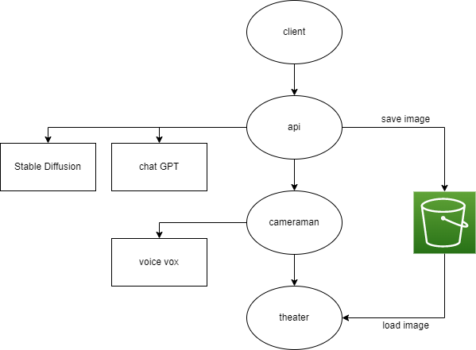

# Maki Architecture

## Client
- エンドユーザー向けのwebフロントエンド
- テーマや動画形式を指定して実行する

## Api
- 各種AIやcameramanに指示を出し動画を取りまとめます

## Cameraman
- theaterに映し出されている画面を撮影し動画化します
- voice voxを使用してテキストから音声を生成します
- 動画と音声を合成します

## Theater
- cameramanの指示に従って提供された素材を画面に配置します
